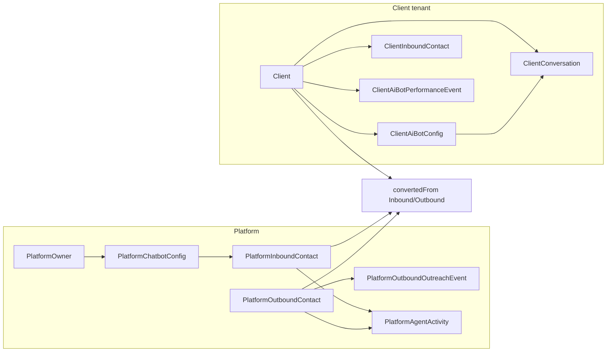

# Firestore to Data Connect full migration

## Current state

**Firestore collections in use:**

Make use of the skill when implementing the migration: [firebase-data-connect](.agents/skills/firebase-data-connect/SKILL.md) 

| Collection                  | Used in                                                                      | Purpose                                                                 |
| --------------------------- | ---------------------------------------------------------------------------- | ----------------------------------------------------------------------- |
| `users`                     | [AuthGuard.tsx](components/AuthGuard.tsx)                                    | Sync user profile (email, role) on login                                |
| `clients`                   | tenant-admin, webhook, embed, chat, tenant-bot, CEO pages                    | Tenant record (name, ownerId, subscriptionActive, paddleSubscriptionId) |
| `clients/{id}/config/agent` | tenant-admin, chat, webhook                                                  | Client bot config (geminiApiKey, systemInstruction)                     |
| `leads`                     | tenant-admin, chat, CEO, admin                                               | Leads per client (clientId, name, email, status)                        |
| `campaigns`                 | [app/ceo/dashboard/campaigns/page.tsx](app/ceo/dashboard/campaigns/page.tsx) | Outbound campaigns (CEO)                                                |
| `agentMetrics`              | [app/ceo/dashboard/metrics/page.tsx](app/ceo/dashboard/metrics/page.tsx)     | Per-client metrics (CEO)                                                |
| `inboundLeads`              | CEO dashboard, prospects                                                     | Platform inbound leads                                                  |
| `agentConfigs`              | [app/bot/[token]/page.tsx](app/bot/[token]/page.tsx)                         | Top-level config keyed by activationToken (differs from subcollection)  |
| `conversations`             | [app/bot/[token]/page.tsx](app/bot/[token]/page.tsx)                         | Chat session state per bot                                              |

**Rules:** [firestore.rules](firestore.rules) — path-based rules with `isClientOwner(clientId)`, `isAdmin()`, `ownerId == request.auth.uid`.

**Data Connect:** [dataconnect/](dataconnect/) already has a service (europe-west1, Cloud SQL `jacobkotzee-fdc`), example connector with Movie/User/Review schema, and SDK generation to `lib/dataconnect-generated` and `src/dataconnect-admin-generated`. The new schema will **replace** the example schema and live in the same `schema/` folder; we will add a **production connector** (e.g. `connectorId: kona` or `main`) and keep or remove the example connector as needed.

---

## Phase 1: Write the Data Connect schema

**File:** [dataconnect/schema/schema.gql](dataconnect/schema/schema.gql). Replace the current Movie/User/Review example with the full schema from this chat. Use Data Connect types from the prelude: `Timestamp`, `Date`, `UUID`, `@default(expr: "uuidV4()")`, `@default(expr: "request.time")`, `@default(expr: "auth.uid")` (see [.dataconnect/schema/prelude.gql](dataconnect/.dataconnect/schema/prelude.gql) and [schema reference](.agents/skills/firebase-data-connect/reference/schema.md)).

**Schema summary (from chat):**

1. **Platform**
  - **PlatformOwner** — `id: String! @default(expr: "auth.uid")`, email, displayName, createdAt. One row (you).
  - **PlatformChatbotConfig** — Native chatbot config: botName, aiModelApiKey, schedulingApiKey, knowledgeBaseJson, createdAt, platformOwner (optional), welcomeMessage, customInstructions.
  - **PlatformInboundContact** — Inbound (they came to us): companyName, websiteUrl, contactStatus, createdAt, contactEmail, initialPitchDraft, identifiedPainPoints, nativeAgent (optional).
  - **PlatformOutboundContact** — Outbound (we found them): scrapedData, hasExistingAI, auditDate, createdAt, aiDetectionDetails.
  - **PlatformOutboundOutreachEvent** — Outreach event for an outbound contact: outreachType, status, sendDate, createdAt, platformOutboundContact!, messageContent, adminNotes.
  - **PlatformAgentActivity** — Metrics: occurredAt, agentType, action, optional links (platformOutboundContact, platformInboundContact, platformOutboundOutreachEvent), targetUrl, outcome, tokensUsed, durationMs, metadata.
2. **Client (tenant)**
  - **Client** — companyName, email, subscriptionStatus, paddleSubscriptionId, createdAt, clientName, industry; **linkedAuthUid: String!** (Firebase UID of the tenant who “owns” this client; replaces Firestore `ownerId`); optional convertedFromInboundContact, convertedFromOutboundContact.
  - **ClientAiBotConfig** — Clone bot: client!, botName, accessToken (used as activation token in bot/[token] route), aiModelApiKey, schedulingApiKey, knowledgeBaseJson, welcomeMessage, customInstructions, createdAt.
  - **ClientInboundContact** — Inbound contact for a client: client!, companyName, websiteUrl, contactStatus, createdAt, contactEmail, initialPitchDraft, identifiedPainPoints.
  - **ClientAiBotPerformanceEvent** — Per-bot performance: client!, occurredAt, eventType, optional clientInboundContact, sessionDurationMs, messageCount, tokensUsed, metadata.
  - **ClientConversation** — For bot chat: client!, clientAiBotConfig (or store accessToken), messages (String/JSON), createdAt, updatedAt. (Required so the bot page can create/update conversations without Firestore.)

All IDs: `id: UUID! @default(expr: "uuidV4()")` except PlatformOwner (`id: String! @default(expr: "auth.uid")`). Use `Timestamp! @default(expr: "request.time")` for createdAt/occurredAt/updatedAt and `Date` for date-only fields (auditDate, sendDate).

**Firestore → Data Connect mapping (for migration and code):**

- `users` (role, email) → PlatformOwner (admin only); tenant identity is Client.linkedAuthUid + Client.email (no separate User table for tenants).
- `clients` → **Client** (ownerId → linkedAuthUid; name → companyName/clientName; subscriptionActive → subscriptionStatus; add linkedAuthUid).
- `clients/{id}/config/agent` → **ClientAiBotConfig** (one per client; geminiApiKey → aiModelApiKey, systemInstruction → customInstructions; add accessToken for iframe/bot route).
- `leads` → **ClientInboundContact** (clientId → client FK; name → companyName; status → contactStatus).
- `campaigns` → **PlatformOutboundOutreachEvent** (or a Campaign grouping table if desired later; for minimal cutover, map to outreach events).
- `agentMetrics` → **PlatformAgentActivity** (platform) + **ClientAiBotPerformanceEvent** (client bots).
- `inboundLeads` → **PlatformInboundContact**.
- `agentConfigs` (by activationToken) → Query **ClientAiBotConfig** by accessToken (one query: get config by accessToken, include client for subscription check).
- `conversations` → **ClientConversation**.

---

## Phase 2: Connector and operations

**New connector** (e.g. [dataconnect/connector/](dataconnect/) or a new dir under dataconnect, e.g. `kona/`). If the project is to have one production connector, add `connector.yaml` and point `connectorDirs` in [dataconnect/dataconnect.yaml](dataconnect/dataconnect.yaml) to it; generate SDK into the same or a dedicated package (e.g. `lib/dataconnect-generated` with connector `kona`).

**Define operations** so the app and webhook can run without Firestore:

- **Queries (examples):** GetClientByLinkedAuthUid(authUid), GetClientById(id), GetClientAiBotConfigByAccessToken(token), ListClientInboundContactsByClient(clientId), ListClients (admin), ListPlatformInboundContacts, ListPlatformOutboundContacts, ListPlatformOutboundOutreachEvents, ListPlatformAgentActivities, ListClientAiBotPerformanceEvents(clientId), GetClientConversation(id), ListClientConversationsByClientAndToken(clientId, accessToken).
- **Mutations (examples):** CreateClient, UpdateClient, CreateClientAiBotConfig, UpdateClientAiBotConfig, CreateClientInboundContact, UpdateClientInboundContact, CreatePlatformInboundContact, CreatePlatformOutboundContact, CreatePlatformOutboundOutreachEvent, CreatePlatformAgentActivity, CreateClientAiBotPerformanceEvent, CreateClientConversation, UpdateClientConversation, UpsertPlatformOwner.

**Auth:** Use Data Connect `@auth` on every operation (see [security reference](.agents/skills/firebase-data-connect/reference/security.md)):

- **PlatformOwner / platform-only:** `@auth(expr: "auth.uid != nil && auth.token.email == 'jakwakwa@gmail.com'")` or a custom claim (e.g. `auth.token.role == 'admin'`) set via Admin SDK after first login.
- **Tenant (client owner):** `@auth(level: USER)` and in the query/mutation filter or @check ensure `Client.linkedAuthUid == auth.uid` (or the resource’s client has that linkedAuthUid).
- **Public (bot widget, embed):** Only the minimal operations that must work unauthenticated: e.g. GetClientAiBotConfigByAccessToken (read-only for config + client subscription status), CreateClientInboundContact (chat capture), CreateClientConversation, UpdateClientConversation. Use `@auth(level: PUBLIC)` with care and only for these; restrict by vars (e.g. accessToken) and server-side checks (subscription active).
- **Webhook (server):** Use Admin SDK for Data Connect (same as existing admin-generated SDK) so the Paddle webhook can run with elevated privileges without Firebase Auth context.

---

## Phase 3: Data migration (optional but recommended)

App is not in production; if there is **no** meaningful data, skip and rely on creating new rows via the app and webhook. If there **is** dev/seed data to keep:

- Export Firestore: `users`, `clients`, subcollection `config/agent`, `leads`, `campaigns`, `agentMetrics`, `inboundLeads`, `agentConfigs`, `conversations` (if any).
- Map into new tables and insert via Data Connect mutations (or SQL scripts against Cloud SQL). Map ownerId → linkedAuthUid; clientId → Client.id; create ClientAiBotConfig with a generated accessToken for each client that had config; leads → ClientInboundContact with client FK.
- Do **not** plan a dual-write or Firestore fallback; after migration, Firestore is no longer read or written.

---

## Phase 4: App code changes (full cutover)

Replace every Firestore usage with Data Connect SDK calls. Use the generated client (and, where needed, admin SDK) from the new connector.

**Files to update:**

1. [lib/firebase.ts](lib/firebase.ts) — Keep Firebase Auth and app init; **remove** Firestore init (getFirestore, initializeFirestore, `db` export). Optionally keep a stub or delete all Firestore imports/exports so nothing references `db`.
2. [lib/firebase-admin.ts](lib/firebase-admin.ts) — Remove Admin Firestore (`adminDb`) once webhook and any server code use Data Connect Admin SDK only.
3. [components/AuthGuard.tsx](components/AuthGuard.tsx) — Replace `getDoc(doc(db, 'users', uid))` / `setDoc(userRef, ...)` with Data Connect: e.g. ensure PlatformOwner row exists (upsert by auth.uid) or a dedicated “ensure user profile” mutation; read role from that row or from custom claims.
4. [app/tenant/tenant-admin/page.tsx](app/tenant/tenant-admin/page.tsx) — Replace Firestore: query Client by linkedAuthUid (auth.currentUser.uid); create Client + ClientAiBotConfig if none; onSnapshot(leads) → poll or use a Data Connect query for ClientInboundContacts by clientId; update Client and ClientAiBotConfig via mutations.
5. [app/tenant/tenant-bot/page.tsx](app/tenant/tenant-bot/page.tsx) — Replace getDoc(client) with Data Connect GetClientById (or by linkedAuthUid).
6. [app/bot/[token]/page.tsx](app/bot/[token]/page.tsx) — Replace agentConfigs query with GetClientAiBotConfigByAccessToken(token); replace getDoc(clients, clientId) with client loaded from that query; replace addDoc(conversations) / updateDoc(conversations) with CreateClientConversation / UpdateClientConversation.
7. [app/api/chat/route.ts](app/api/chat/route.ts) — Replace getDoc(clientRef), getDoc(configRef) with Data Connect (get config by clientId or by a token in the request); replace addDoc(leads) with CreateClientInboundContact.
8. [app/api/embed/[clientId]/route.ts](app/api/embed/[clientId]/route.ts) — Replace getDoc(clientRef) with Data Connect GetClientById(clientId).
9. [app/api/webhook/paddle/route.ts](app/api/webhook/paddle/route.ts) — Replace adminDb.collection('clients') with Data Connect Admin SDK: query Client by linkedAuthUid (ownerId); create Client + ClientAiBotConfig or update Client (subscriptionStatus, paddleSubscriptionId); no Firestore batch, use mutations (or a single transactional mutation if supported).
10. [app/ceo/dashboard/page.tsx](app/ceo/dashboard/page.tsx) — Replace onSnapshot(clients), onSnapshot(leads), onSnapshot(inboundLeads) with Data Connect queries (list Clients, list ClientInboundContacts or PlatformInboundContacts as appropriate), with polling or refetch (no real-time listeners; Data Connect is request/response).
11. [app/ceo/dashboard/campaigns/page.tsx](app/ceo/dashboard/campaigns/page.tsx) — Replace campaigns collection with PlatformOutboundOutreachEvent (and optional Campaign table if needed); list/create/update via Data Connect.
12. [app/ceo/dashboard/prospects/page.tsx](app/ceo/dashboard/prospects/page.tsx) — Same as CEO dashboard: clients, leads, inboundLeads → Data Connect queries.
13. [app/ceo/dashboard/admin/page.tsx](app/ceo/dashboard/admin/page.tsx) — List clients and leads via Data Connect.
14. [app/ceo/dashboard/metrics/page.tsx](app/ceo/dashboard/metrics/page.tsx) — Replace agentMetrics with PlatformAgentActivity and ClientAiBotPerformanceEvent; list and write via Data Connect.

**Real-time:** Data Connect has no onSnapshot. Replace all onSnapshot usage with: initial fetch + periodic refetch (setInterval or React Query/SWR), or a “Refresh” button. Document this in the plan so CEO and tenant dashboards are explicitly refetch-based.

**Offline / FirestoreOfflineHandler:** [components/FirestoreOfflineHandler.tsx](components/FirestoreOfflineHandler.tsx) is Firestore-specific. Remove or replace with a generic “network error” / “retry” handler for Data Connect request failures.

---

## Phase 5: Remove Firestore and legacy

- Delete or strip Firestore from [firestore.rules](firestore.rules) (or leave file in repo with a comment that Firestore is deprecated; do not deploy rules for new DB usage).
- Remove Firestore from [firebase.json](firebase.json) if it deploys rules (or stop deploying Firestore config).
- [firebase-blueprint.json](firebase-blueprint.json) — Update to describe the Data Connect schema as source of truth, or remove if it was Firestore-only.
- Uninstall or stop using `firebase/firestore` and `firebase-admin/firestore` in the app and API routes.
- Ensure [.firebaserc](.firebaserc) and Firebase project still have Auth and any other services you need; only Firestore usage is removed.

---

## Phase 6: Verification

- Run `bun run build` and fix any type or import errors.
- Manually or with scripts: (1) Platform owner login (AuthGuard + PlatformOwner upsert). (2) Tenant flow: login → tenant-admin → see/create Client and ClientAiBotConfig, see ClientInboundContacts. (3) Bot widget: open bot/[token], send message, create conversation and optional lead. (4) CEO dashboard: list clients, leads, campaigns, metrics. (5) Paddle webhook: subscription.activated creates/updates Client and ClientAiBotConfig; subscription.canceled updates Client. No Firestore reads or writes in any path.

---

## Diagram (conceptual)

---

## Order of implementation

1. **Schema** — Write full [dataconnect/schema/schema.gql](dataconnect/schema/schema.gql); run `firebase dataconnect:sdk:generate` (or equivalent) and fix any schema errors.
2. **Connector** — Add production connector with queries/mutations and @auth; generate SDK.
3. **Data** — If needed, one-time Firestore export and map into Data Connect (or start fresh).
4. **Code** — Replace Firestore in all listed files with Data Connect; remove Firestore init and admin DB.
5. **Cleanup** — Firestore rules/config, blueprint, FirestoreOfflineHandler; verify build and flows.
6. **Verify** — Build + smoke tests for auth, tenant, bot, CEO, webhook.

